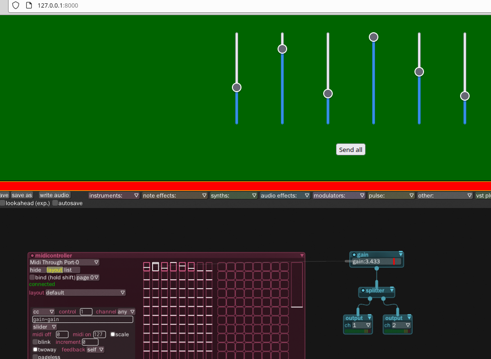

# midi-browser

Connect your browser to a python websocket server proxying incoming messages to midi.
This allows to use your browser on e.g. your tablet to send midi messages on your
computer to your DAW - rendering your tablet into a midi controller.

This is open source so with some knowledge on html/js/css you can easily develop a much
fancier browser UI than the one in the screenshot that allows you to control your DAW.

(PR's highly appreciated!)

_NO MIDI browser API required!_

## Install:

    git submodule update --init --recursive
    pip3 install -r requirements.txt

You will probably also need some kind of `midi through`.
Go into `index.html` and setup all variables (especially `MIDI_DEVICE_NAME` - the midi
controller you want to connect to).

## Running:

    ./start.sh

now browse to `127.0.0.1:8000`

## Debug Run:

    npm i -g nodemon

    ./start.sh nodemon

## Troubleshooting:

    ps aux | grep server

    user     70077  0.1  0.0  94588 18244 pts/9    S    17:45   0:00 python3 -m http.server
    user     70078  0.3  0.0 110432 23976 pts/9    Sl   17:45   0:00 python3 server.py

    kill -9 70077 70078

## TODO:
- [ ] have sliders that support multi-touch so multiple sliders can be swiped at the
 same time
